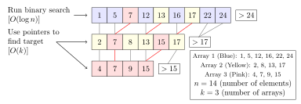

# Fractional Cascading

This is a simple project to demonstrate the data structure technique called Fractional Cascading.

*From [Wikipedia]((https://en.wikipedia.org/wiki/Fractional_cascading)) :*
> In computer science, fractional cascading is a technique to speed up a sequence of binary searches for the same value in a sequence of related data structures. The first binary search in the sequence takes a logarithmic amount of time, as is standard for binary searches, but successive searches in the sequence are faster.



**Remark:** *"searching for a value" means finding either lower/upper bounds, otherwise merging the lists or hashing could better solve this problem.*
*In the picture above, if we search the lower bound of 13 we should find \[12, 13, 9\]*

[(Erik Demaine) Quick explanation of Fractional Cascading](https://www.youtube.com/watch?v=NMxLL3D5qd8&t=3270s)

[(Erik Demaine) 6.851: Advanced Data Structures (Spring'12)](http://courses.csail.mit.edu/6.851/spring12/)

## Benchmark

We see on the benchmarks below that
- The fractional cascading is ~2 times slower to build.

*Notice: lists have a randomly chosen size.*

### Large lists (100 lists of 800000 elements)

On this benchmark
- Repeated searches are 4.3 times faster
- Not in cache searches are 1.7 times faster

```
--------------------------------------------------------------------------------------------------------------
Benchmark                                                                    Time             CPU   Iterations
--------------------------------------------------------------------------------------------------------------
BM_binary_search_count_naive                                              15.5 us         15.5 us        45535
BM_binary_search_count_fractional_cascading                               3.60 us         3.60 us       192477
BM_binary_search_count_naive_no_cache/iterations:100                      37.9 us         37.4 us          100
BM_binary_search_count_fractional_cascading_no_cache/iterations:100       22.7 us         21.3 us          100
BM_build_naive                                                            1.07 s          1.07 s             1
BM_build_fractional_cascading                                             2.36 s          2.36 s             1
```

### Small lists (10000 lists of 8000 elements)

On this benchmark
- All searches are slower in the fractional cascading.

```
--------------------------------------------------------------------------------------------------------------
Benchmark                                                                    Time             CPU   Iterations
--------------------------------------------------------------------------------------------------------------
BM_binary_search_count_naive                                               972 us          972 us          736
BM_binary_search_count_fractional_cascading                               1221 us         1221 us          514
BM_binary_search_count_naive_no_cache/iterations:100                      1124 us         1124 us          100
BM_binary_search_count_fractional_cascading_no_cache/iterations:100       1562 us         1562 us          100
BM_build_naive                                                            1.00 s          1.00 s             1
BM_build_fractional_cascading                                             2.25 s          2.25 s             1
```

## Tests

The tests coverage is 100% for this commit (see git blame).

## Dependencies

[Google Test](https://github.com/google/googletest)

[Google Benchmark](https://github.com/google/benchmark)
